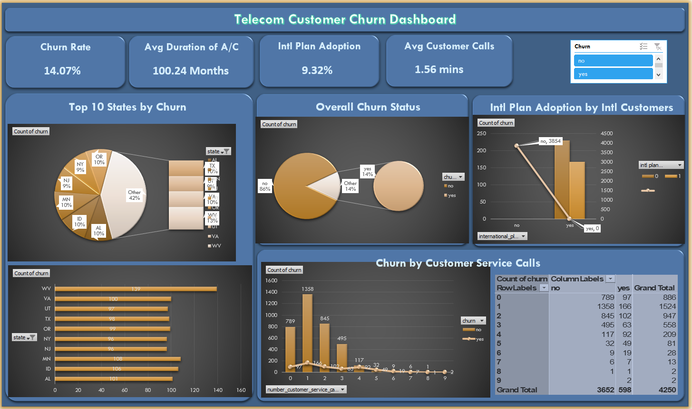

# TelecomCummunication-Churn

---

## Overview

This project investigates customer churn trends at a leading telecommunications company to uncover the key factors driving customers to discontinue their services. By analyzing behavioral patterns, service usage metrics, and customer interaction history, the study delivers actionable insights aimed at designing effective retention initiatives and enhancing overall customer satisfaction.

---

## Dataset

This analysis leverages the [Kaggle Customer Churn Prediction 2020 dataset](https://www.kaggle.com/competitions/customer-churn-prediction-2020/data), a synthetic yet realistic representation of customer behavior for a U.S.-based telecom provider. Comprising **5,000 customer records** and **20 descriptive features**, the dataset is structured to predict whether a customer will churn (leave the service). Sourced from a Kaggle competition, it offers a cross-sectional view of customer accounts at a single point in time. Key variables include the binary target `churn`, demographic indicators like `state` and `account_length`, service plan choices (`international_plan`, `voice_mail_plan`), and detailed usage metrics across day, evening, night, and international call categories. Additional engagement signals such as voicemail messages and customer service contacts are also included. All monetary values are denominated in USD, and while `area_code` is encoded as text (e.g., "area_code_415"), it can be parsed for geographic insights. Though synthetic, the data mirrors real-world churn patterns, making it ideal for predictive modeling and strategic business analysis.

---

## Analysis Outcome

To uncover the drivers of customer attrition, we conducted a comprehensive and structured analysis:

- Calculated the **overall churn rate and total number of churned customers** to quantify the business impact.
- Benchmarked churned versus retained customers on critical dimensions such as **account tenure, frequency of customer service calls, and call-related charges** across day, evening, night, and international segments.
- Assessed how enrollment in specific **service plans—like International or Voicemail Plans—influences churn probability**.
- Examined correlations between **usage behaviors** (e.g., total call minutes, call frequency) and the likelihood of leaving.
- Performed **geographic segmentation by Area Code** to pinpoint regions with elevated churn rates.
- Explored interaction effects—for instance, whether **high international call charges disproportionately increase churn among subscribers of the International Plan**.
- Evaluated behavioral thresholds, such as whether **making more than three customer service calls significantly escalates churn risk**.
- Applied **cluster analysis** to group customers by usage profiles and compare their respective churn tendencies.
- Analyzed churn trends across **quartiles of account length** to determine if newer or long-term customers are more vulnerable.

This layered approach progressed from macro-level metrics to granular behavioral segments, revealing not only *that* customers churn, but precisely *who* is at risk, *when*, and under *which service conditions*—enabling precise, data-driven retention initiatives.

## Dashboard

**⚠️ IMPORTANT: To use this dashboard, open the file `Train.xlsx` and navigate to the “Dashboard” sheet. All interactive elements function only within this tab.**

- This dashboard provides a strategic overview of customer churn at Telecommunications, enabling data-driven decisions to improve retention.
- Key performance indicators include an overall **churn rate of 14.07%**, average account duration of **100.24 months**, and **1.56 average customer service calls** per customer.
- Visuals highlight the **top 10 states by churn volume**, with West Virginia (WV) leading at 139 churned customers, helping identify geographic hotspots.
- The **overall churn status** is displayed via a donut chart, showing 86% retained vs. 14% churned customers.
- An interactive chart reveals how **international plan adoption correlates with churn**, indicating that subscribers without the plan are more likely to leave.
- The **churn-by-customer-service-calls** analysis shows a sharp increase in churn risk for customers making 3+ service calls, highlighting service experience as a key driver.
- Designed for leadership and customer success teams to prioritize interventions, allocate resources, and tailor retention campaigns based on actionable insights.

---

## Author & Contact
- Name: `Kshitij Saini`
/ [LinkedIn](https://www.linkedin.com/in/kshitij-saini-b950b7299?utm_source=share_via&utm_content=profile&utm_medium=member_android)

    
